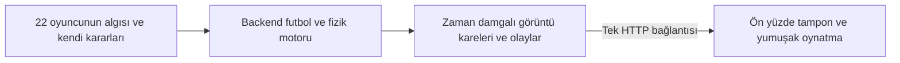

# 2D Football — Yerel maç motoru

Node.js 22+ ile çalışan 11'e 11 futbol simülasyonu. **Her takımın dizilişi maç öncesinde ayrı seçilir:** 4–4–2, 4–3–3, 4–2–3–1 veya 3–5–2. Varsayılan düzen 4–4–2'dir. İki takımın 22 oyuncusu kendi durumuna göre ayrı karar verir. GPT/OpenAI bağlantısı, model seçimi, API anahtarı ve token ücreti yoktur. Harici npm bağımlılığı gerekmez.

## Çalıştırma

```powershell
node server.js
```

[http://localhost:3000](http://localhost:3000) adresini açın. Alternatif komut `npm.cmd start`. Başka port için PowerShell'de `$env:PORT = '3001'` ayarlayın. Sunucu yalnızca `127.0.0.1` üzerinde dinler.

## Mimari



### 22 bağımsız oyuncu

Her oyuncunun mevkisi, şut gücü, şut isabeti, pas isabeti, hızı, dayanıklılığı, mevcut enerjisi, müdahale sertliği ve karar sayacı ayrıdır. Ortak karar algoritması her oyuncu için kendi verileriyle çalışır; 22 ayrı servis veya yapay zekâ modeli gerekmez.

Oyuncular **yaklaşık 200 ms'de bir** aynı saha durumunu okuyarak karar verir. Önce herkesin niyeti hesaplanır, sonra birlikte uygulanır; kadroda önce gelen oyuncu sıradan dolayı avantaj kazanmaz. Top sahibinin değişmesi ve önemli oyun olayları yeni değerlendirmeyi beklemeden tetikler. Toplu oyuncu pas, top sürme ve şut arasında seçim yapar; topsuz oyuncular pres, destek, topa koşu ve savunmaya dönüş hedefleri alır. İhraç edilen oyuncular karar ve fiziğe katılmaz.

Şut gücü oyuncuya 20–40 m arasında kişisel menzil verir; menzil otomatik şut emri değildir. Şut isabeti vuruşun hedefinden ne kadar sapabileceğini, pas isabeti planlanan pas noktasından gerçek fiziksel sapmayı belirler. Daha iyi pozisyondaki boş takım arkadaşına pas ve açık koridordan kaleye yaklaşma önce değerlendirilir. Pas yolu, rakip hareketi ve topun varış süresi hesaba katılır. Kaleci yaklaşırsa veya baskı gelirse erken bitiriş mümkündür. Kalecinin bir şuttaki kurtarış denemesi her fizik karesinde tekrar çekilmez.

Forvet veya hücum oyuncusu savunma arkasında koşabileceği açık bir hatta sahipse pas ayağına gönderilmez. Motor pas mesafesi, alıcının sürati ve kalecinin konumundan 5–14 m arasında bir koşu hedefi çıkarır; top bu oyuncu ile kaleci arasındaki alana bırakılır. Forvetin önünde ya da yanında koşu koridoruna 4,2 m'den yakın savunmacı varsa ara pası iptal edilir ve normal pas hedefi değerlendirilir. Arkadan yetişmeye çalışan savunmacı açık koşu yolunu kapatmaz. Kaleci alanı daraltmışsa top kalecinin önüne bırakılmaz. Alıcı pas uçuşu başladığı anda hedef noktaya koşar. Ofsayt oyuncunun pas çıktığı andaki konumundan hesaplanmaya devam eder; topun ilerideki hedef noktası tek başına ofsayt oluşturmaz.

### Beş oyuncu özelliği

- **Şut gücü:** 20–40 m kişisel şut menzili ve vuruş hızı.
- **Şut isabeti:** %55–%90; mesafe ve baskıyla birlikte fiziksel şut sapmasını belirler.
- **Pas isabeti:** %70–%96; pas puanına girer ve planlanan hedef ile gerçek top yolu arasındaki sapmayı belirler.
- **Hız:** Katsayılar 0,87–1,131 arasındadır; en hızlı oyuncu en yavaştan tam %30 hızlıdır.
- **Dayanıklılık:** 60–90 arasındadır; en yüksek değer en düşükten %50 fazladır. Koşu enerjiyi azaltır, düşen enerji azami hızı kademeli olarak etkiler.

### Backend hesaplaması

- Fizik **40 Hz**, görüntü kareleri **20 Hz** üretilir.
- Her maç ayrı bir Node.js worker thread içinde çalışır; hesaplama HTTP sunucusunu meşgul etmez.
- Top oyundayken hesaplama ön yüzden karar istemeden sürer. Gol, topun dışarı çıkması ve faul görüntü bölümünü kapatır.
- Tarayıcı maçı aynı açık NDJSON bağlantısından alır ve backend'den 0,5 oyun saniyelik parçalar ister. Kısa kontrol istekleri yalnızca hazırlanacak sonraki bölümü ve canlı hız ayarlarını bildirir.
- Yavaş izleyicide soket geri basıncı hesaplamayı sınırlar. Worker yalnızca bir sonraki parça istendiğinde üretir; sınırsız maç kuyruğu oluşturulmaz.
- Aynı başlangıç tohumu aynı sonucu ve kareleri üretir. Bu, hatalı bir pozisyonu tekrar incelemek için kullanılabilir.

### Ön yüz

Ön yüz fizik veya futbol kararı hesaplamaz. Gelen kareleri sırayla oynatır, aralarını yumuşatır. Gelecekteki skor ve olaylar önceden gösterilmez. Gol/santra gibi konum sıçramalarında oyuncular sahanın içinden kaydırılmaz. Görüntü gecikirse zaman durur; tarayıcı sonucu tahmin etmez.

Yaklaşık bir saniyelik hazır görüntü tutulur. Bu kısa tampon maç içinde değiştirilen hızların yaklaşık bir saniye içinde sahaya yansımasını sağlar. Duraklatma görüntüyü dondurur; backend yalnızca bu sınırlı miktarda önden hesaplar. Yeni maç eski bağlantıyı iptal eder ve worker sonlandırılır. Kopan akış için açık hata gösterilir; otomatik olarak farklı bir maçla devam edilmez.

## Kullanım ve diziliş

- **Maçı başlat / Duraklat:** 5 dakikalık tek devreyi izletir. Sekme arka plana geçince durur.
- **10 sn oynat:** Görüntüyü tam 10 oyun saniyesi ilerletir.
- **Yeni maç:** Yeni tohumla yeni maç açar.
- **Takım düzeni:** Lime FC ve Coral United için bağımsız diziliş seçimi. Maç başlamadan değiştirdiğinizde önceki hazırlık akışı iptal edilir; saha ve oyuncu görevleri yeni seçime göre hazırlanır. Başlat veya 10 sn oynat düğmesine basınca seçimler kilitlenir; duraklatmak kilidi açmaz. Yeni maç seçimleri koruyarak kilidi açar.
- **Oyuncu kartı:** Seçilen oyuncunun beş kişisel özelliğini, anlık enerji yüzdesini, hareketini ve karar nedenini gösterir.
- **Oyuncu hızları:** Toplu saha oyuncusu, normal topsuz hareket, depar ve kaleci temel hızları maç sırasında ayrı ayarlanır. Varsayılan değerler sırasıyla 4,9; 5,7; 7,1 ve 4,8 m/sn'dir. Kontra koşusu normal topsuz hızı kullanır. Pres, boş top, savunmaya dönüş, forvetin gol tarafını kapatma ve açık ara pası koşusu depar grubundadır. Bireysel hız katsayısı ve enerji etkisi bu temel değerin üzerine uygulanır.
- **Karar ekranı:** Varsayılan Otomatik seçim top sahibini, top hareket halindeyken son vuruşu yapan oyuncuyu takip eder. Kullanıcı 22 oyuncudan birini seçerek ekranı o oyuncuya sabitleyebilir. Top sahibinde öncelik tablosu; tüm oyuncularda mevki hedefi, yerleşim düzeltmesi, pres/boş top seçimi, özel hareket görevi, koridor/ofsayt sınırları, son koordinat, hız, dayanıklılık ve enerji hesabı görünür. Mavi çizgi izlenen oyuncunun hareket hedefidir.
- **Duraklat ve incele / Sonraki karar:** Görüntüyü durdurur veya seçili oyuncunun ilk yeni değerlendirmesine kadar ilerletir. Sabit 0,2 saniye atlamaz; top değişimiyle erken gelen karar da yakalanır. Debug modun pas öncesi duraklamaları önceliğini korur. Yeni karar bekleyen oyuncu ihraç edilirse oynatma durur.
- **Maç modu → Debug mod:** Maç başlamadan seçilir. Her gerçek pasın hemen öncesinde görüntü durur; pas veren, alıcı, karar zamanı ve diğer 10 takım arkadaşının puanları gösterilir. **Pası oynat · Sonraki pasa kadar** düğmesiyle ilerlenir. 10 saniyelik oynatma da aradaki ilk pas kontrolünde durur. Yeni maç mod kilidini açar.

### Pas hesapları ve ofsayt

Top sahibi için karar sırası: duran top özel kuralı → daha iyi gol fırsatına pas → savunma arkasına kilit pas → açık alandan kaleye yaklaşma → uygun şut → normal pas → topu sürerek koruma. İlk uygun seçenek seçilir; alt öncelikler çalıştırılmaz ve ekranda “Sıra gelmedi” görünür. Kilit pas, forvet/kanat/ofansif orta sahanın güvenli ve ofsaytsız koşusunun son bölgede en az 8 metre ilerleme oluşturmasıyla seçilir. Normal pas niyeti, güvenli bir aday bulunması ve şu tetiklerden biriyle oluşur: oyuncunun kaleci olması, aday puanının 0,55'i ve ileri mesafesinin 3 m'yi aşması, en yakın saha rakibinin 4 m içine gelmesi veya duran top kullanılması.

Pas/şutun seçilmesi ile fiziksel uygulanması ayrıdır. Topu aldıktan sonra saha oyuncusunda 0,2 sn, kalecide 0,4 sn kontrol süresi vardır; normal oyunda bu süre bitince, top hâlâ oyuncudaysa ve plan geçerliyse seçilen vuruş uygulanır. Top sürme seçilmişse sürenin dolması tek başına pas yaptırmaz. Duran topların ayrıca yeniden başlama beklemesi vardır. Karar ekranı güncel beklemeyi ve son kararın zamanını ayrı gösterir. Pas hedefinde kimse topa dokunmazsa top aniden durmaz; kalan hızıyla yuvarlanır, 3,2 m/sn² zemin sürtünmesiyle yavaşlar ve hareket yolu boyunca oyuncu/saha sınırı çarpışmaları denetlenir.

22 aktif oyuncu aynı dünya durumunu yaklaşık 0,2 oyun saniyesinde bir okur (5 Hz hedef; 0,025 sn fizik adımlarına oturur). Top sahibi veya önemli olay değişirse sonraki fizik adımında erken analiz yapılır. Duran top beklemesinde analiz durur; ihraç edilenler yeni karar almaz. Görüntü normalde 0,05 sn aralıkla gelir; yeni karar arada oluşursa ayrıca kare gönderilir. Bunlar maçın simülasyon süreleridir; backend görüntü tamponunun önünde hesaplayabilir. Açıklamalar backend kararından alınır; tarayıcıda yeni futbol kararı üretilmez.

Debug tablosu motorun karar verirken kullandığı değerleri gösterir; ayrı bir açıklama modeli çalışmaz. Normal pas puanı `hedeflenen ilerleme × 0,055 × görüş + min(boş alan, 8) × 0,1 + pas isabeti katkısı − gerçek pas mesafesi × 0,017 − kaleci cezası` şeklindedir. Ara pasında hedeflenen ilerleme oyuncunun mevcut yeri yerine koşu yolundaki noktadan alınır; alıcının ileri ve çapraz hareket hedefi buluşma noktasını belirler. Koşu payı pas mesafesine ve oyuncu süratine göre 5–14 metre arasındadır. Kaleciye pas cezası 0,5'tir. Önce daha iyi gol fırsatı aranır; ara pasında varış noktasındaki şut kalitesi, topu kontrol etmenin belirsizliği için 0,84 ile düşürülür; pas mesafesi ve beklenen isabet sapması çıkarılır. Normal pas, kilit pas ve gol fırsatı puanları farklı karar aşamalarına aittir. Mesafe, kapalı pas koridoru, kapalı koşu yolu, ofsayt, markaj, oyuncuya özgü isabet ve şut açısı gibi nedenler her aday için gösterilir. Duran toplarda uygun hedef bulunamazsa en yakın oyuncu seçilir ve bu istisna açıklanır.

Kararlar yaklaşık 200 ms aralıklarla alındığından karar zamanı ile pasın fiziksel çıkış zamanı ayrı gösterilir. Debug yalnızca görüntüyü durdurur; backend aynı maçı tampon sınırları içinde hesaplamaya devam eder. Normal modun fiziğini veya rastgele sayı dizisini değiştirmez. Her pas öncesi özel kare gönderilir; oynatma hızındaki bir sıçrama bu kontrolü atlayamaz.

Ofsayt sınırı top, sondan ikinci aktif rakip (kaleci dahil) ve orta çizginin hücum yönünde en ileride olanıdır. Sönük kesikli çizgi vuruş anında sabitlenir. Aynı hizada veya kendi yarı alanında olan oyuncu ofsaytta değildir. Vuruş anında ofsayttaki oyuncu topa dokunursa ya da yakındaki rakiple top için mücadeleye girerse rakibe ihlal yerinden endirekt serbest vuruş verilir. Sadece ofsayt konumunda durmak ihlal değildir. Taç, korner ve auttan doğrudan gelen top muaftır; sonraki takım arkadaşı vuruşunda yeniden değerlendirilir. Endirekt serbest vuruş başka oyuncuya değmeden doğrudan gol olamaz. Temel kurallar: [IFAB Kural 11](https://www.theifab.com/laws/latest/offside/).

2D yaklaşım oyuncu merkezlerini kullanır; vücut parçaları ve kalecinin görüşünü kapatma modellenmez. Kurtarışlar mevcut motorda kalecinin topu tutmasıdır; sekme/saptırma ayrımı bulunmaz. Topsuz hücumcular, pas öncesi koşu hedeflerini ofsayt sınırının gerisinde tutmaya çalışır.

Varsayılan 4–4–2 düzeninde forma numaraları:

| Numara | Mevki |
|---|---|
| 1 | Kaleci |
| 2 | Sol bek |
| 3–4 | Stoperler |
| 5 | Sağ bek |
| 6 | Sol orta saha |
| 7–8 | Merkez orta saha |
| 9 | Sağ orta saha |
| 10–11 | İki forvet |

Rakip takımın koordinatları iki eksende aynalanır. Bekler kanatlarını korur; top tarafındaki bek bindirirken diğer bek güvenlik sağlar. Top kaybında geri koşu başlar. En fazla iki oyuncu, kontra savunmasında bir oyuncu yakın pres yapar. Tehlikeli forvet ve kanat koşularında uygun savunmacı sabit mevki çizgisini bırakıp rakibin 2,5 metre gol tarafına hedef alır; kalan savunma hattı da en derindeki tehdidin gerisine iner. Toplu oyuncu ve pası karşılayan oyuncu, pozisyon gerektirirse topsuz derinlik sınırının ilerisine çıkabilir.

Diğer dizilişlerde forma numarasının görevi değişebilir; iki takımın güncel mevki listesi seçimlerin altında gösterilir. Davranışlar forma numarasına değil oyuncunun seçilen rolüne bağlıdır: 4–3–3'te ön libero ve kanatlar, 4–2–3–1'de iki ön libero ve ofansif orta saha, 3–5–2'de üç stoper ve kanat bekler bulunur. Santra ve gol sonrası yerleşimler seçilen dizilişleri korur.

## HTTP sözleşmesi

- `GET /api/config`: Yerel motor, hesaplama aralıkları, mevcut dizilişler, varsayılan hızlar ve hız sınırları.
- `POST /api/match`: `{}` veya örneğin `{ "seed": 17, "formations": ["4-3-3", "3-5-2"], "mode": "debug", "speeds": { "onBall": 4.9, "offBall": 5.7, "sprint": 7.1, "keeper": 4.8 }, "controlled": true }`. Mod `normal` (varsayılan) veya `debug` olabilir. Dizilişler ev sahibi/deplasman sırasındadır; verilmezse iki takım da 4–4–2 olur. Tek yanıt `application/x-ndjson` akışıdır.
- `POST /api/match/control`: Kontrollü bir maçta `{ "matchId": "...", "action": "next" }` bir sonraki 0,5 saniyeyi hazırlar. `action: "speeds"` ve dört hız değeri, aynı worker içindeki sonraki hesaplamalara uygulanır.
- İlk satır `ready`: başlangıç sahası, tohum, iki takımın `formations` dizisi ve süre.
- Sonraki satırlar `frames`: artan `sequence`, `segment`, `boundary`, zaman damgalı `frames`, `ended`.
- Karelerde `offsides` ve `offsideLine` bulunur. Debug modda pas öncesi kare ayrıca artan kimlikli `debugPass` ve gerçek kararın `candidates` hesaplarını taşır; kare zamanları yine kesin olarak artar.
- `timing` fizik/karar/görüntü aralıklarını ve kontrol/duran top beklemesini taşır. Her oyuncunun `decision.report` alanı karar anını, tetikleyicisini, gerçekten çalıştırılan aksiyon kontrollerini ve hareket hesabını taşır. HTTP akışı aynı raporu her karede tekrarlamaz: değişmeyen `report` alanı atlanır; Playback yalnızca önceki karedeki aynı oyuncunun raporunu devralır. Gelecekteki karar eski görüntüye uygulanmaz.
- `ended: true` ile maç tamamlanır. İstemci iptali hesaplamayı durdurur.

İstemci skor/oyuncu konumu gönderemez; geçerli maç durumu yalnızca backend'dedir. Aynı anda en fazla dört yerel maç hesaplanır. Eski `/api/key` ve `/api/decision` uçları kaldırılmıştır.

## Sınırlar

Pas, dripling, pres, top kapma, yakın/uzak şut, kurtarış, gol, taç, aut, korner, ofsayt, temas kaynaklı faul, kartlar, serbest vuruş ve penaltı vardır. Duran top yerleşimleri ve kart kuralları basitleştirilmiştir. Avantaj, elle oynama, sakatlık, devre arası ve oyuncu değişikliği yoktur. Pozisyon değerlendirmesi sezgisel bir puandır; gerçek maç verileriyle eğitilmiş xG değildir. Tam bir Football Manager motoru iddiası taşımaz.

## Kod ve doğrulama

| Dosya | Görevi |
|---|---|
| `backend/players.js` | Oyuncu başına algılama, niyet ve karar |
| `backend/formations.js` | Dört dizilişin rol, koridor ve başlangıç konumları |
| `backend/speeds.js` | Dört canlı hız grubunun varsayılanları ve doğrulaması |
| `backend/traits.js` | Beş oyuncu özelliğinin dağılımı ve sınırları |
| `backend/tactics.js` | Mevkiye göre takım şekli, pas/şut/koşu değerlendirmesi |
| `backend/engine.js` | Futbol kuralları ve fizik |
| `backend/simulation.js` | Tohum, sabit zaman adımları ve görüntü parçaları |
| `backend/worker.js` | Ayrı hesaplama iş parçacığı |
| `server.js` | Tek bağlantılı maç akışı ve yerel HTTP sunucusu |
| `public/playback.js` | Sıra kontrolü, görüntü tamponu, interpolasyon |
| `public/app.js`, `public/pitch.js` | Kontroller, oyuncu inceleme ve Canvas çizimi |

```powershell
node --test
```

Testler hücum ve savunma davranışlarını, 4–4–2 dizilişini, oyuncu başına kararları, iki yönde gol/penaltıyı, bölüm sınırlarını, aynı tohumla tekrar üretimi, beş dakikalık tek bağlantıyı, bağlantı iptalinde worker temizliğini, görüntü sıralamasını, duraklatma ve sıfırlamayı kontrol eder. Arayüz testleri DOM taklidi kullanır; gerçek tarayıcı görsel kontrolünün yerine geçmez.
